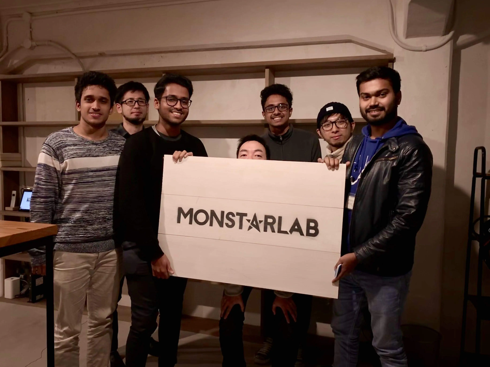
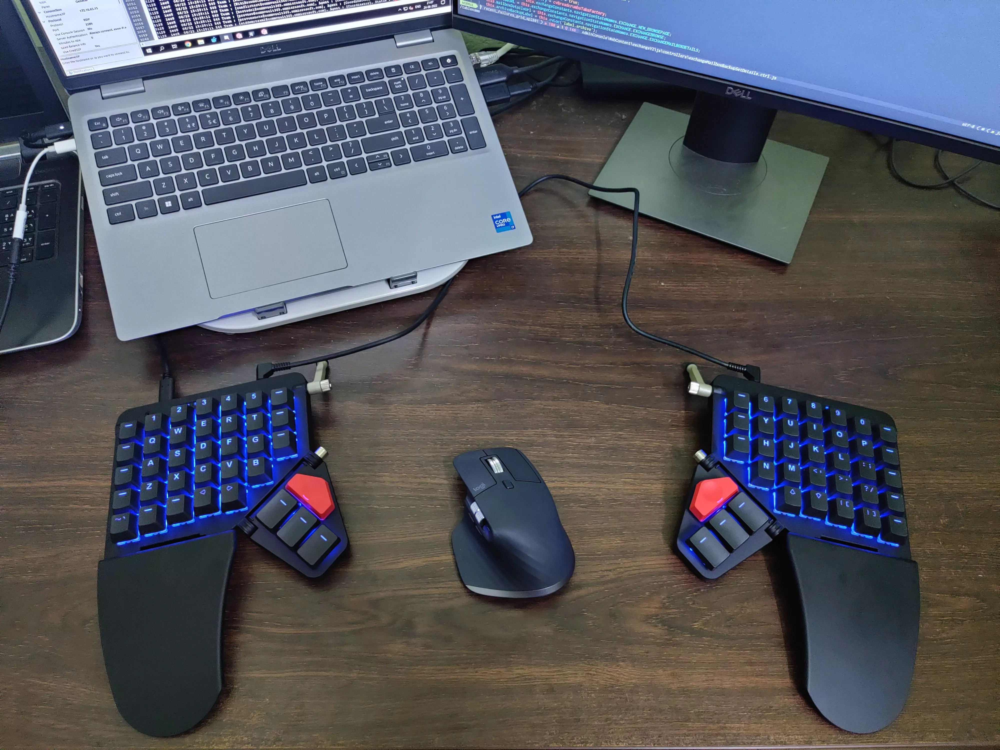

## My journey in unlocking Vim productivity

March 2019. Day 6 into my internship at the Shimane office of Monstarlab, Japan. Seated at a corner, I'm trying to debug an issue related to the routing of `DELETE` methods in a Rails app. An hour has passed and I still haven't figured out a thing. So, I raise the white flag and ping my mentor, Mitomo-san about the bug. In a few minutes, he gets to my desk with his MacBook and asks for the details. Instantly recognizing the fix, he brings up a shell, launches Vim and starts typing away. Fuzzy finders appear, files show up on the screen, and the cursor moves all over the place. Not even making a glance at the keyboard, text gets added, modified and deleted. Finally, he diffs, stages, commits and pushes his fixes, all within Vim!

_Woah_

I'd never seen Vim used like that. It was like watching an expert pianist play the Flight of the Bumblebee. Movements were instinctual and purely from muscle memory. A sort of mind-machine connection had been established.

Seeing Mitomo-san use Vim lit up a deep desire in me. I wanted to edit text at the _speed of thought_. For a hunt-and-peck typer like me, this would mean months of effort learning to touch type and building a muscle memory around Vim motions.

<em>Mitomo-san (second from right) and me (third from left)</em>

## Enter ThePrimeagen

Fast forward a few months. I've graduated and joined Commvault as a Software Engineer. Due to efforts in getting acclimated to the job, I still haven't made any progress towards touch typing and Vim. Then COVID hits. Lockdowns are declared across India. We're all asked to work from home. With most employees trying to remotely access their machines, there are frequent network disruptions and latency issues. This would be a great time to get started.

Around the same time, I'm also actively following [ThePrimeagen](https://www.twitch.tv/theprimeagen) on Twitch. He would live-stream programming on Vim, with his [Kinesis](https://kinesis-ergo.com/shop/advantage2) keyboard. He also put out a number of YouTube videos on setting up your first `.vimrc`, installing fuzzy-finders and language servers. One thing he kept advising was to get good at typing before doing anything Vim. Since most Vim motions are focused around the homerow of the QWERTY layout, it would be ideal to touch type on it.

So, on a hot Friday afternoon, locked down in my flat at Hyderabad, I started taking touch typing lessons on [Ratatype](https://www.ratatype.com). The course starts with drills of individual keys and eventually combines them to form words and sentences with punctuation. By Sunday, I've a rough memory of all key locations, but can only do 7-10 WPM. But, I decide to stick with the regime and never glance down at my keyboard. Over weeks of replying painfully slow to Teams DMs and emails, I finally start to see improvements. My WPM goes up to 35 and I've already eclipsed my previous speed! It felt like I unlocked something new. Simple tasks started to feel fluid. I could search Google and StackOverflow faster, my emails and messages were more descriptive, and overall productivity was much higher.

## Gaining traction

Now, with a decent typing speed, I could afford to start practicing Vim. The beta release of [`microsoft/terminal`](https://github.com/microsoft/terminal) had just come out, so I installed both the terminal and Vim. Practicing Vim would also complement my touch typing, since all the motions are done from the keyboard. But, barebones Vim on a software project is nearly unusable. There is no syntax highlighting, language intelligence, file or keyword search built-in. All you get is a buffer of text that respects the motions.

`.vimrc` is the file responsible for dishing out your Vim preferences. With it, you get to install plugins that support all the modern features of an editor. Initially, I'd tried [SpaceVim](https://spacevim.org), but found it too bloated for my liking. I like to have a deep understanding of the tools I use, so I decided to configure Vim from scratch. Following guides from ThePrimeagen, I setup a ~400 line `.vimrc` that replicated everything I did on VS Code. This included plugins for language intelligence: [`neoclide/coc.nvim`](https://github.com/neoclide/coc.nvim), syntax highlighting [`sheerun/vim-polyglot`](https://github.com/sheerun/vim-polyglot), fuzzy finding: [`junegunn/fzf.vim`](https://github.com/junegunn/fzf.vim), and my favorite color theme: [`joshdick/onedark.vim`](https://github.com/joshdick/onedark.vim)

Slowly, but surely, I was gaining traction. I found myself using VS Code less often, and resorting to Vim for every PR I wrote at work. The [`tpope/vim-fugitive`](https://github.com/tpope/vim-fugitive) plugin even allowed me to diff, stage and commit changes within Vim, just like Mitomo-san! I also wrote a few custom Vimscript functions that made working on my codebase feel like _magic_. My colleagues started taking notice; even asking me how to get it setup on their machines!

My typing speed also kept increasing steadily. Typing fast was fun and I spent a lot of time on [TypeRacer](https://play.typeracer.com), [keybr](https://www.keybr.com) and [Monkeytype](https://monkeytype.com). Touch typing helped me Vim better and using Vim helped me type better!

## Neovim and beyond

By mid 2022, I switched to [Neovim](https://neovim.io), a modern fork of Vim. It has better support for asynchronous plugins (which can be written in Lua), developer APIs, [Tree-sitter](https://tree-sitter.github.io/tree-sitter) parsers, and comes builtin with an [LSP client](https://microsoft.github.io/language-server-protocol). Now that I was spending more time on the terminal, I started incorporating tools like [tmux](https://github.com/tmux/tmux/wiki), [fzf](https://github.com/junegunn/fzf) and [ripgrep](https://github.com/BurntSushi/ripgrep) into my workflow. I also ported my Vim config into Lua and replaced various Vimscript plugins with modern, Lua alternatives, like [`nvim-telescope/telescope.nvim`](https://github.com/nvim-telescope/telescope.nvim) (for fuzzy finding), and [`williamboman/mason.nvim`](https://github.com/williamboman/mason.nvim) (for managing LSP servers, linters and formatters).

There was one thing I felt missing though. ThePrimeagen would stream with his split, ortholinear [Kinesis](https://kinesis-ergo.com/shop/advantage2) keyboard, and I wanted the same experience. So, I went ahead and bought the [ZSA Moonlander](https://www.zsa.io/moonlander). This was a great decision as the split layout helped me gain better posture and ergonomics. The Moonlander runs on the [QMK Firmware](https://qmk.fm), so I was also able to setup layers that remapped `h, j, k, l` to the arrow keys. This way, I could use Vim motions across the computer!

<em>The ZSA Moonlander on my desk</em>

It's hard to overstate the impact a skill has on your productivity. Over the years, I picture all the hours saved just by typing fast and using Vim. In the words of ThePrimeagen, I can finally say:

<blockquote class="twitter-tweet" data-lang="en" data-theme="dark" data-align="center">
i use neovim btw
&mdash; ThePrimeagen (@ThePrimeagen) <a href="https://twitter.com/ThePrimeagen/status/1777795540190650807?ref_src=twsrc%5Etfw">April 9, 2024</a></blockquote> 

